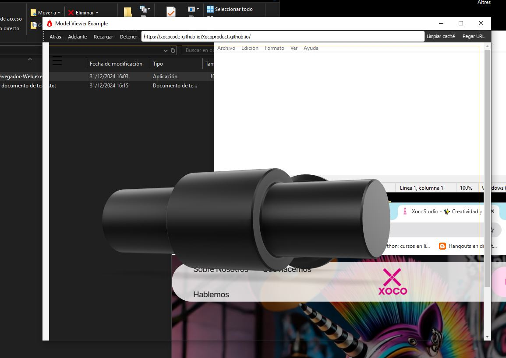

# Navegador Transparente

## Descripción

**Navegador Transparente** es una aplicación de navegador web personalizada desarrollada con PyQt5. Este navegador ofrece una interfaz transparente, permitiendo una experiencia visual única y minimalista. Ideal para usuarios que buscan una herramienta ligera y personalizable para navegar por la web.

## Características

- **Interfaz Transparente:** Diseño elegante con transparencia ajustable.
- **Barra de Navegación Personalizable:** Incluye botones de navegación, barra de direcciones y opciones adicionales.
- **Funciones de Navegación Completa:** Soporta retroceder, avanzar, recargar y detener la carga de páginas.
- **Gestión de Caché:** Permite limpiar la caché directamente desde la interfaz.
- **Integración con el Portapapeles:** Facilita la carga de URLs desde el portapapeles.
- **Soporte para Múltiples Ventanas:** Capacidad para abrir múltiples instancias del navegador.

2. **Funciones Disponibles:**
   
   - **Navegar a una URL:** Ingresa la dirección en la barra de direcciones y presiona Enter.
   - **Botones de Navegación:** Usa los botones de atrás, adelante, recargar y detener para controlar la navegación.
   - **Limpiar Caché:** Haz clic en el botón "Limpiar caché" para borrar la caché del navegador.
   - **Pegar URL:** Utiliza el botón "Pegar URL" para cargar la URL copiada en el portapapeles.
   - **Ajustar Transparencia:** Usa las teclas `+` y `-` para aumentar o disminuir la opacidad de la ventana.

## Descarga

Puedes descargar la última versión del **Navegador Transparente** desde el siguiente enlace:

[🔗 Descargar Navegador Transparente](https://drive.google.com/file/d/1c9Q25zjw6qz_nVXJpFNrGfQQ-HH31mCK/view?usp=sharing)

[🔗 Web con fondo transparente](https://xococode.github.io/Xocoproduct.github.io/)

## Descargo de Responsabilidad

**Importante:** El uso de este código es bajo total responsabilidad del usuario. ** Xocostudio** no se hace responsable por ningún tipo de mal uso, daño directo o indirecto, pérdida de datos, o cualquier otro perjuicio que pueda derivarse del uso de este software.

### Sin Garantías

El software se proporciona "tal cual", sin garantías de ningún tipo, ya sean expresas o implícitas. Esto incluye, pero no se limita a, las garantías de comerciabilidad, adecuación para un propósito particular y no infracción.

### Exención de Responsabilidad

Los autores no son responsables por cualquier reclamación, daño u otra responsabilidad que surja del uso del software, ya sea en una acción de contrato, agravio o de otra manera, que surja de, fuera de o en conexión con el software o el uso u otros tratos en el software.

### Uso del Código

Al descargar y utilizar este código, aceptas hacerlo bajo tu propio riesgo. Es tu responsabilidad asegurarte de que el software es adecuado para tus necesidades y de tomar todas las precauciones necesarias para evitar posibles daños o pérdidas.

Si tienes alguna pregunta o necesitas más información, por favor contacta a Xocostudio.

---

*¡Gracias por utilizar nuestro software! Asegúrate de leer y entender este descargo de responsabilidad antes de proceder.*

